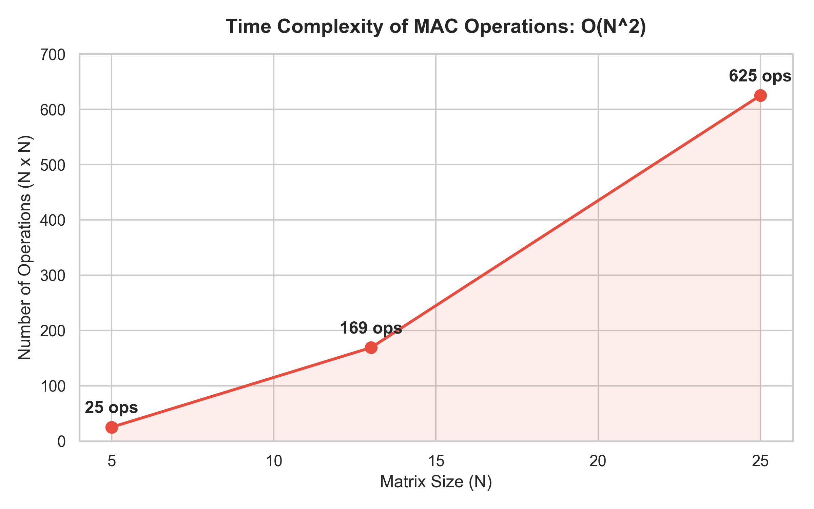

# 🧠 Mini NPU Simulator


> **MAC(Multiply-Accumulate) 연산**을 통해 입력된 행렬 패턴이 십자가(Cross)인지 X인지 판별하는 소프트웨어 NPU 시뮬레이터입니다.

---

## 🚀 시작하기

**프로젝트 실행**
```bash
python src/main.py
```

**실행 모드**
1. **사용자 입력 (3×3)**: 콘솔에서 3×3 필터(A, B)와 패턴을 직접 입력하여 실시간 판정
2. **데이터 분석 (`data.json`)**: 외부 JSON 데이터(5×5, 13×13, 25×25)를 읽어들여 일괄 MAC 연산 및 성능 분석 수행

*(※ `data.json`은 `data/` 디렉토리에 위치해야 합니다.)*

---

## 🛠️ 핵심 구현 원리

- **정규화 (Label Normalization)**: `+`, `x` 등 다양한 라벨 표기를 내부 표준(`Cross`, `X`)으로 통일하여 비교 오류 방지
- **순수 MAC 연산**: 외부 라이브러리(NumPy 등) 없이, 이중 `for` 루프를 통한 N×N 행렬 곱셈/누산(MAC) 직접 구현
- **EPSILON 동점 처리**: 부동소수점 오차(IEEE 754)를 방어하기 위해 `1e-9` 임계값 기반의 안전한 `float` 비교 정책 사용
- **클린 코드**: 모든 함수 `15줄 이하` 분리 및 `typing` 모듈을 활용한 100% 타입 힌트 적용

---

## 📊 평가 리포트

### 1. 실패 원인 분석 (Failure Analysis)
모드 2(`data.json` 분석) 실행 시 발생하는 `FAIL` 케이스의 주된 원인은 다음과 같습니다:
* **동점 규칙 (UNDECIDED)**: 두 필터 점수의 차이가 `1e-9` 미만일 때 발생 (의도적으로 헷갈리게 설계된 데이터)
* **스키마/라벨 불일치**: 형식을 벗어난 Key(`size_{N}_{idx}` 위반) 또는 지정되지 않은 라벨 보유
* **수치 오차 누적**: 부동소수점 덧셈 누적으로 인한 미세 오차가 임계값 범위를 벗어날 경우

### 2. 시간 복잡도 분석: $O(N^2)$
MAC 연산은 행렬의 모든 원소를 한 번씩 순회하므로 행렬 크기 N에 대해 $O(N^2)$의 시간 복잡도를 가집니다.



| 행렬 크기 | 원소 수 (연산 횟수) | 예상 소요 시간 |
| :---: | :---: | :---: |
| **5 × 5** | 25회 | 기준 (1x) |
| **13 × 13** | 169회 | 약 6.8x |
| **25 × 25** | 625회 | 약 25x |

> 💡 **시사점:** 크기가 커질수록 연산량이 기하급수적으로 증가합니다. 딥러닝 현업에서 CPU 대신 극도의 병렬 처리가 가능한 **전용 하드웨어(NPU) 시스톨릭 어레이**를 도입하는 근본적인 이유가 여기에 있습니다.

---

## 📚 관련 문서

더 깊이 있는 기술 원리와 하드웨어 구조에 대해 알아보시려면 아래 심층 문서를 참고하세요.
* [📘 기술 심층 분석 및 NPU 활용 사례 가이드 (TECHNICAL_DEEP_DIVE.md)](docs/TECHNICAL_DEEP_DIVE.md)
