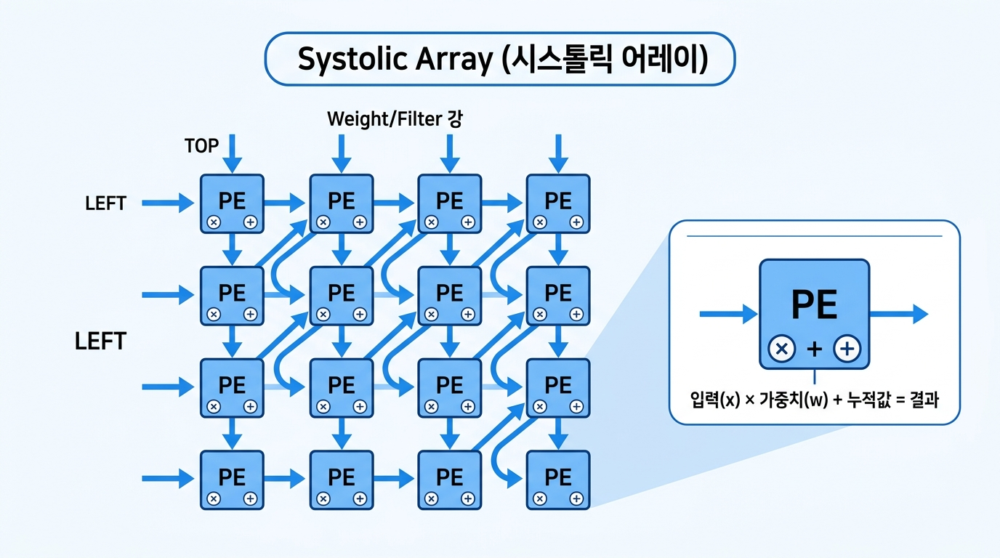
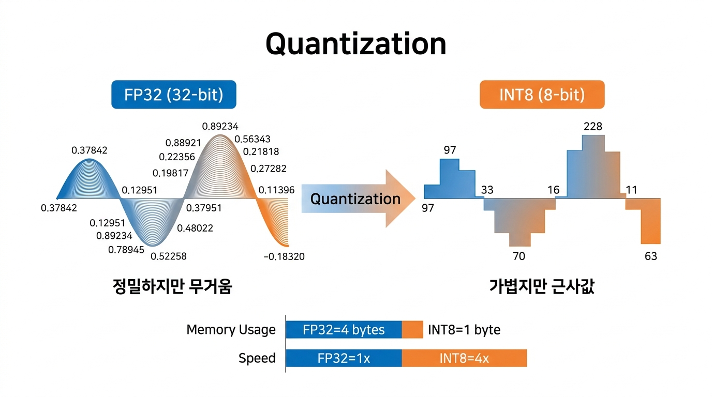
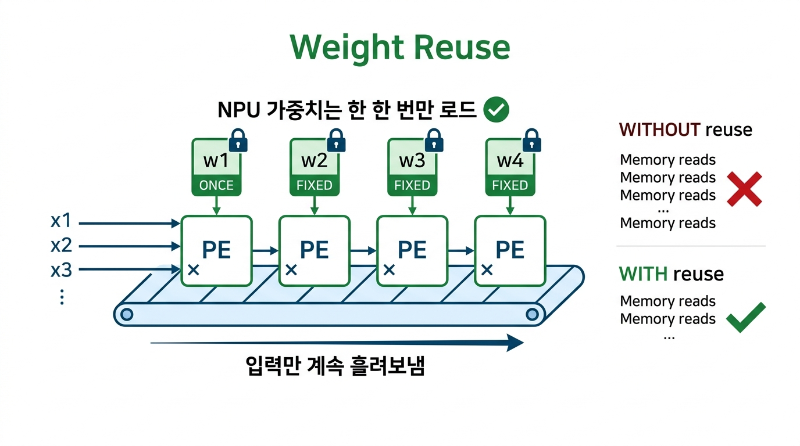

# Mini NPU Simulator - 기술 심층 분석 문서

> 이 문서는 Mini NPU Simulator 프로젝트에서 사용된 핵심 기술 원리와 NPU의 실제 활용에 대한 심층 분석을 담고 있습니다.

---

## 목차

1. [time.perf_counter() 상세 분석](#1-timeperfcounter-상세-분석)
2. [부동소수점과 EPSILON 비교 정책](#2-부동소수점과-epsilon-비교-정책)
3. [NPU 아키텍처와 CPU 대비 병목 분석](#3-npu-아키텍처와-cpu-대비-병목-분석)
4. [NPU 활용 사례와 행렬 연산 최적화](#4-npu-활용-사례와-행렬-연산-최적화)

---

## 1. time.perf_counter() 상세 분석

### 1.1 이 함수는 무엇을 하는가?

`time.perf_counter()`는 Python 표준 라이브러리 `time` 모듈에 포함된 **고해상도 성능 카운터** 함수입니다.

```python
import time

start = time.perf_counter()    # 시작 시점의 카운터 값 (단위: 초)
# ... 측정하고 싶은 코드 ...
end = time.perf_counter()      # 종료 시점의 카운터 값

elapsed = end - start          # 경과 시간 (초, float)
```

이 함수가 반환하는 값 자체는 **특정 시점을 나타내는 절대값이 아닙니다**. 프로그램 실행 중 어떤 임의의 기준점으로부터 경과된 시간(초)을 반환하므로, **두 호출 간의 차이**만 의미가 있습니다.

### 1.2 내부 동작 원리

운영체제별로 서로 다른 하드웨어 타이머를 사용합니다:

| OS | 내부 호출 | 해상도 |
|----|----------|--------|
| **Windows** | `QueryPerformanceCounter()` | ~100 나노초 (ns) |
| **macOS** | `mach_absolute_time()` | ~41.67 ns (24 MHz 기준) |
| **Linux** | `clock_gettime(CLOCK_MONOTONIC)` | ~1 ns |

**핵심 특성:**

- **단조 증가 (Monotonic)**: 시스템 시계를 수동으로 변경해도 `perf_counter()`의 값은 절대 뒤로 가지 않습니다. 이는 시간 측정의 정확성을 보장합니다.
- **고해상도**: 나노초 ~ 마이크로초 수준의 정밀도를 제공합니다.
- **sleep 시간 포함**: 프로세스가 `time.sleep()`으로 대기한 시간도 경과 시간에 포함됩니다.

### 1.3 다른 시간 측정 함수와의 비교

| 함수 | 해상도 | sleep 포함 | 시스템 시계 영향 | 용도 |
|------|--------|-----------|----------------|------|
| `time.time()` | ~ms | O | **받음** (NTP 동기화 시 역행 가능) | 날짜/시각 표시 |
| `time.perf_counter()` | ~ns | O | 받지 않음 | **성능 벤치마크** |
| `time.process_time()` | ~ns | **X** | 받지 않음 | CPU 순수 사용 시간 |
| `time.monotonic()` | ~ms | O | 받지 않음 | 타임아웃 관리 |
| `time.perf_counter_ns()` | ns(정수) | O | 받지 않음 | 초정밀 벤치마크 |

### 1.4 왜 perf_counter()를 선택했는가?

이 프로젝트에서 `perf_counter()`를 사용한 이유:

1. **I/O 배제 목적에 부합**: MAC 연산 함수 호출 구간만 감싸면 연산 시간만 측정 가능
2. **시스템 시계 독립**: NTP 동기화나 사용자의 시계 변경에 영향받지 않음
3. **충분한 해상도**: 3×3 행렬의 MAC 연산처럼 마이크로초 단위의 짧은 작업도 측정 가능
4. **표준 라이브러리**: 외부 패키지 설치 없이 바로 사용 가능

### 1.5 측정 시 주의사항

```python
# ❌ 잘못된 방식: I/O가 측정에 포함됨
start = time.perf_counter()
pattern = input("패턴 입력: ")        # I/O 시간 포함됨
score = mac_operation(pattern, filter)
elapsed = time.perf_counter() - start

# ✅ 올바른 방식: 연산 구간만 측정
pattern = input("패턴 입력: ")         # I/O는 측정 밖에서
start = time.perf_counter()
score = mac_operation(pattern, filter)  # 연산만 측정
elapsed = time.perf_counter() - start
```

반복 측정의 필요성:

```python
# 1회 측정 → 운영체제 스케줄링, 캐시 상태 등에 의한 잡음(noise)이 큼
# 10회 반복 측정 후 평균 → 안정적인 결과
start = time.perf_counter()
for _ in range(10):
    score = mac_operation(pattern, filter)
avg_time = (time.perf_counter() - start) / 10
```

---

## 2. 부동소수점과 EPSILON 비교 정책

### 2.1 컴퓨터는 실수를 어떻게 저장하는가?

인간은 10진수를 사용하지만, 컴퓨터는 **2진수(0과 1)**로만 숫자를 표현합니다.

#### 정수의 경우: 정확한 표현

```
13 (10진수)  →  1101 (2진수)
= 1×2³ + 1×2² + 0×2¹ + 1×2⁰
= 8 + 4 + 0 + 1
= 13  ← 정확!
```

#### 소수의 경우: 근사 표현

소수는 2의 **음수 거듭제곱**의 합으로 표현합니다:

```
0.5   = 1/2¹         = 0.1 (2진수)     ← 정확!
0.25  = 1/2²         = 0.01 (2진수)    ← 정확!
0.75  = 1/2¹ + 1/2²  = 0.11 (2진수)    ← 정확!
```

하지만 **0.1**을 2진수로 변환하면:

```
0.1 (10진수) = 0.0001100110011001100110011... (2진수)
                      ↑ "0011"이 무한 반복!
```

이것은 10진수에서 1/3 = 0.333333...이 무한소수인 것과 같은 원리입니다. **1/2의 거듭제곱 합으로 정확히 표현할 수 없는 수**는 모두 2진수에서 무한소수가 됩니다.

### 2.2 IEEE 754 표준: 무한소수를 유한한 비트에 담기

컴퓨터는 무한한 메모리를 가질 수 없으므로, 실수를 **유한한 비트**에 담아야 합니다. 이를 위해 **IEEE 754** 국제 표준을 사용합니다.

Python의 `float`는 **64비트(8바이트) 배정밀도(double precision)** 형식을 사용합니다:

```
┌──────┬────────────┬──────────────────────────────────────────────────────┐
│ 부호 │  지수부    │                    가수부 (mantissa)                  │
│ 1bit │  11 bits   │                     52 bits                         │
└──────┴────────────┴──────────────────────────────────────────────────────┘
 ↑        ↑              ↑
 양/음    크기 범위       정밀도 (유효 숫자)
```

**각 부분의 역할:**

| 구분 | 비트 수 | 역할 | 예시 |
|------|---------|------|------|
| 부호 (Sign) | 1비트 | 양수(0) / 음수(1) 구분 | 0 → 양수 |
| 지수부 (Exponent) | 11비트 | 소수점 위치 (2의 거듭제곱) | 01111111011 → 2⁻⁴ |
| 가수부 (Mantissa) | 52비트 | 유효 숫자 | 1.1001100110011... |

실수 값 = **(-1)^부호 × 2^(지수-1023) × 1.가수부**

#### 0.1이 저장되는 실제 과정

```
0.1 (10진수)

1단계: 2진수 변환
  0.1 = 0.0001100110011001100110011001100110011001100110011001101...
                                                               ↑
                                                          53번째 비트에서 반올림!

2단계: 정규화 (1.xxx × 2^n 형태로 변환)
  = 1.1001100110011001100110011001100110011001100110011010 × 2⁻⁴

3단계: 64비트에 저장
  부호: 0
  지수: 01111111011  (1019₁₀ → 1019 - 1023 = -4)
  가수: 1001100110011001100110011001100110011001100110011010

4단계: 실제 저장된 값을 10진수로 복원
  = 0.1000000000000000055511151231257827021181583404541015625
```

**0.1을 저장하려고 했지만 실제로는 0.10000000000000000555...가 저장된 것입니다!**

### 2.3 부동소수점 오차의 실제 사례

```python
>>> 0.1 + 0.2
0.30000000000000004          # 0.3이 아님!

>>> 0.1 + 0.2 == 0.3
False                        # 같지 않다고 판정!

>>> 0.1 * 3
0.30000000000000004          # 역시 정확히 0.3이 아님

>>> 1.0 - 0.7
0.30000000000000004          # 또 다시...

>>> 0.1 + 0.1 + 0.1 - 0.3
5.551115123125783e-17        # 0이 아니라 아주 작은 수
```

이런 오차는 **버그가 아닙니다**. 2진수 체계의 근본적 한계입니다.

### 2.4 무한소수는 어떻게 처리되는가?

컴퓨터가 무한소수를 처리하는 방식을 정리하면:

| 상황 | 처리 방식 | 결과 |
|------|----------|------|
| 2진수 유한소수 (0.5, 0.25) | **정확히 저장** | 오차 없음 |
| 2진수 무한소수 (0.1, 0.3) | 52비트에서 **반올림(절단)** | 미세 오차 발생 |
| 10진수 무한소수 (1/3) | 2진수로도 무한 → **반올림** | 미세 오차 발생 |
| 연산 누적 (0.1 × 1000번 합산) | 매 연산마다 반올림 → **오차 누적** | 오차가 점점 커짐 |
| 매우 큰 수와 작은 수 합산 | 지수부 차이로 작은 수 **소멸** | 정보 손실 |

#### 오차 누적의 위험성

```python
# 0.1을 10번 더하면?
total = 0.0
for _ in range(10):
    total += 0.1
print(total)           # 0.9999999999999999 (1.0이 아님!)
print(total == 1.0)    # False

# 0.3을 100번 더하면?
total = 0.0
for _ in range(100):
    total += 0.3
print(total)           # 29.999999999999996 (30.0이 아님!)
```

**MAC 연산에서의 영향:**

```
패턴:  [0.3, 0.3, 0.3, ...]  (N×N 행렬)
필터:  [0.3, 0.3, 0.3, ...]  (N×N 행렬)

Cross 점수 = 0.3×0.3 + 0.3×0.3 + ... = 0.09 × N²
X 점수     = 0.3×0.3 + 0.3×0.3 + ... = (비슷한 값)

→ 두 점수가 수학적으로는 같아도, 컴퓨터에서는 미세하게 다를 수 있음!
```

### 2.5 EPSILON 비교 정책이 필요한 이유

#### 잘못된 비교 (직접 비교)

```python
# ❌ 위험: 수학적으로 같은 값도 False가 나올 수 있음
if score_cross == score_x:
    print("동점")

# 예: score_cross = 7.499999999999997
#     score_x     = 7.500000000000000
# → 수학적으로 같은 값이지만 != 판정
```

#### 올바른 비교 (EPSILON 기반)

```python
EPSILON = 1e-9  # 0.000000001

# ✅ 안전: 두 값의 차이가 허용 범위 내이면 동점
if abs(score_cross - score_x) < EPSILON:
    print("동점 (UNDECIDED)")
```

#### EPSILON 값의 선택 기준

| EPSILON 값 | 의미 | 장점 | 단점 |
|-----------|------|------|------|
| `1e-15` | 거의 == 비교와 동일 | 정말 같은 값만 동점 | 여전히 오차에 취약 |
| **`1e-9`** | **적절한 허용 범위** | **대부분의 부동소수점 오차 흡수** | **약간의 차이를 무시** |
| `1e-6` | 넓은 허용 범위 | 더 많은 오차 흡수 | 실제 차이도 동점 처리될 수 있음 |
| `0.01` | 너무 넓음 | - | 정밀도 의미 없음 |

`1e-9`를 선택한 이유:
- 64비트 float의 유효 자릿수는 약 15~17자리
- `1e-9`는 소수점 9자리까지의 차이를 무시 → 나머지 6~8자리의 유효 자릿수를 보전
- 대부분의 MAC 연산 오차(~`1e-16` 수준)를 안전하게 흡수

### 2.6 Python의 다른 실수 처리 방법

```python
# 1. decimal 모듈: 10진수 정밀 연산 (느리지만 정확)
from decimal import Decimal
Decimal('0.1') + Decimal('0.2') == Decimal('0.3')  # True!

# 2. fractions 모듈: 분수로 정확히 표현
from fractions import Fraction
Fraction(1, 10) + Fraction(2, 10) == Fraction(3, 10)  # True!

# 3. math.isclose(): Python 표준 라이브러리의 근사 비교
import math
math.isclose(0.1 + 0.2, 0.3)  # True
```

하지만 이 프로젝트에서는 **성능이 중요**하므로 `float` + EPSILON 비교를 사용합니다. `Decimal`은 `float` 대비 약 **100배 느립니다**.

---

## 3. NPU 아키텍처와 CPU 대비 병목 분석

### 3.1 CPU, GPU, NPU 비교

| 특성 | CPU | GPU | NPU |
|------|-----|-----|-----|
| **설계 목적** | 범용 순차 처리 | 그래픽/병렬 연산 | AI 추론 특화 |
| **코어 수** | 4~64개 (고성능) | 수천~수만 개 (저성능) | 수백~수천 개 (MAC 전용) |
| **클럭 속도** | 3~5 GHz | 1~2 GHz | 0.5~1.5 GHz |
| **메모리 대역폭** | ~50 GB/s | ~900 GB/s | ~50 GB/s (온칩 SRAM 활용) |
| **전력 효율** | 낮음 (65~125W) | 보통 (200~350W) | **높음 (5~30W)** |
| **MAC 효율** | 매우 낮음 | 높음 | **최고** |

### 3.2 NPU의 핵심 아키텍처 (시스톨릭 어레이)

NPU는 **MAC 연산 하나만을 극도로 효율적으로 수행**하기 위해 설계된 칩입니다. CPU가 한 명의 천재 수학자라면, NPU는 수천 명의 학생(PE)들이 줄을 지어 앉아 단순 계산을 분업하는 형태입니다.



#### Processing Element (PE) 한 개의 내부

```
     가중치(w) ───▶ ┌────────────┐
                    │  곱셈기     │
     입력(x) ────▶  │  w × x     │──▶ ┌────────────┐
                    └────────────┘    │  덧셈기     │
     이전 누적값 ─────────────────────▶│  sum + w×x  │──▶ 다음 PE 또는 출력
                                      └────────────┘
```

각 PE는 **1 클럭 사이클에 1번의 MAC 연산**을 수행합니다. 256×256 크기의 Systolic Array라면, **1 클럭에 65,536번의 MAC 연산**을 동시에 처리합니다.

#### Systolic Array (시스톨릭 어레이)

"Systolic"은 **심장 박동(수축)**을 의미합니다. 데이터가 심장처럼 **규칙적인 박자로 PE 사이를 흐릅니다**:

```
시간 T=0:               시간 T=1:               시간 T=2:
┌────┬────┬────┐      ┌────┬────┬────┐      ┌────┬────┬────┐
│ a₁ │    │    │      │ a₂ │ a₁ │    │      │ a₃ │ a₂ │ a₁ │
├────┼────┼────┤      ├────┼────┼────┤      ├────┼────┼────┤
│    │    │    │      │ b₁ │    │    │      │ b₂ │ b₁ │    │
├────┼────┼────┤      ├────┼────┼────┤      ├────┼────┼────┤
│    │    │    │      │    │    │    │      │ c₁ │    │    │
└────┴────┴────┘      └────┴────┴────┘      └────┴────┴────┘

→ 데이터가 파도처럼 한 칸씩 이동하며, 모든 PE가 동시에 MAC 연산 수행
→ 데이터를 한 번 로드하면 여러 PE에서 재사용 → 메모리 접근 최소화
```

### 3.3 CPU로도 가능한 작업을 NPU로 처리할 때의 문제점과 병목

#### 문제점 1: 데이터 전송 오버헤드 (Data Transfer Overhead)

```
CPU 메인 메모리 (DRAM)
       │
       │  ← PCIe / DMA 전송 (느림)
       ▼
NPU 온칩 SRAM
       │
       │  ← 연산 (매우 빠름)
       ▼
NPU 결과 출력
       │
       │  ← 다시 DRAM으로 전송 (느림)
       ▼
CPU 메인 메모리
```

**작은 행렬(3×3)의 경우:**
- CPU에서 직접 계산: ~0.01ms (즉시 완료)
- NPU로 전송 → 계산 → 결과 회수: ~1ms (전송 시간이 연산 시간의 100배!)

**이것이 바로 "전송 오버헤드가 연산 이득을 초과하는" 상황입니다.**

#### 문제점 2: 작은 연산에서의 PE 활용도 저하

```
256×256 Systolic Array (65,536개 PE)에 3×3 행렬을 맡기면:

  사용되는 PE: 9개 (3×3)
  쉬는 PE:    65,527개

  → PE 활용률 = 9 / 65,536 = 0.014% (극히 비효율적!)
```

#### 문제점 3: 양자화(Quantization) 정밀도 손실

NPU는 성능을 위해 **낮은 비트 정밀도**를 사용합니다.

컴퓨터가 기억할 수 있는 메모리는 한정되어 있으므로, AI 모델의 크기가 너무 커지면 연산이 느려지고 메모리도 부족해집니다. 이를 해결하기 위해 데이터를 "단순하게 압축"하는 기술이 **양자화**입니다.



| 연산 타입 | 비트 수 | 정밀도 | 사용 위치 |
|----------|---------|--------|----------|
| FP64 (double) | 64비트 | 매우 높음 | CPU |
| FP32 (float) | 32비트 | 높음 | CPU / GPU |
| FP16 (half) | 16비트 | 보통 | GPU / NPU |
| INT8 | 8비트 | 낮음 | **NPU** |
| INT4 | 4비트 | 매우 낮음 | 일부 NPU |

* **FP32 (32-bit 부동소수점)**: 정확도는 높지만 메모리를 많이 차지(4 bytes)하고 계산이 무겁습니다.
* **INT8 (8-bit 정수)**: 값을 단순한 정수(예: 97, 33)로 뭉뚱그려 표현합니다. 정밀도는 살짝 떨어지지만, 메모리는 1/4(1 byte)로 줄어들고 속도는 최대 4배까지 빨라집니다.

```python
# CPU (FP64): 0.1 + 0.2 = 0.30000000000000004 (15자리 정밀도)
# NPU (INT8): 0.1 → 25/255 ≈ 0.098, 0.2 → 51/255 ≈ 0.200
#             합산 = 76/255 ≈ 0.298 (2자리 정밀도)
```

정밀한 과학 계산이 필요한 경우, NPU의 양자화가 **허용할 수 없는 오차**를 만들 수 있습니다. 반면 딥러닝 추론에서는 이 정도 근사값도 충분한 결과를 내기 때문에 NPU의 속도와 효율성 이득이 압도적으로 큽니다.

#### 문제점 4: 분기 처리 불가

NPU는 `if/else` 같은 **조건 분기를 처리할 수 없습니다**:

```python
# ❌ NPU가 처리할 수 없는 코드
for r in range(n):
    for c in range(n):
        if pattern[r][c] > 0.5:       # 조건 분기!
            score += pattern[r][c] * filter[r][c]
        else:
            score -= pattern[r][c]     # 다른 연산 경로!

# ✅ NPU가 잘 처리하는 코드
for r in range(n):
    for c in range(n):
        score += pattern[r][c] * filter[r][c]  # 단순 반복 MAC
```

#### 문제점 5: 프로그래밍 복잡성

```
CPU 프로그래밍:
  Python → score = sum(a*b for a, b in zip(pattern, filter))
  → 즉시 실행, 디버깅 쉬움

NPU 프로그래밍:
  1. 모델 정의 (PyTorch/TensorFlow)
  2. 모델 컴파일 (ONNX 변환)
  3. 양자화 (FP32 → INT8)
  4. NPU 런타임에 로드
  5. 입력 데이터를 NPU 포맷으로 변환
  6. 추론 실행
  7. 결과를 CPU 포맷으로 역변환
  → 복잡한 파이프라인, 디버깅 어려움
```

#### 병목 발생 기준: 언제 NPU가 유리해지는가?

```
                    연산 시간
                     ▲
                     │             CPU (O(N²), 직렬)
                     │           ╱
                     │         ╱
                     │       ╱
                     │     ╱ ←── 교차점 (Break-even)
                     │   ╱        보통 N > 64~128
                     │ ╱───────── NPU (O(1)~O(N), 병렬 + 전송 오버헤드)
                     │╱
                     └──────────────────────▶ 행렬 크기 N
```

| 행렬 크기 | CPU | NPU | 추천 |
|----------|-----|-----|------|
| 3×3 | 0.01ms | 1ms+ (전송 오버헤드) | **CPU** |
| 25×25 | 0.1ms | 1ms+ | **CPU** |
| 128×128 | ~5ms | ~2ms | **비슷** |
| 512×512 | ~100ms | ~3ms | **NPU** |
| 1000×1000 | ~1,000ms | ~5ms | **확실히 NPU** |

### 3.4 CPU의 직렬 처리 vs NPU의 병렬 처리

이 프로젝트의 MAC 연산을 CPU와 NPU 관점에서 비교:

```python
# CPU: 순차 처리 (직렬)
# 25×25 = 625번의 곱셈을 하나씩 수행
score = 0.0
for r in range(25):         # 반복 1
    for c in range(25):     # 반복 2
        score += p[r][c] * f[r][c]  # 1번의 곱셈 + 1번의 덧셈
# 총 소요: 625 클럭 사이클 (최소)
```

```
# NPU: 병렬 처리
# 25×25 = 625번의 곱셈을 625개의 PE가 동시에 수행
시간 T=0: 모든 PE에 데이터 분배
시간 T=1: 625개 PE가 동시에 곱셈 수행 ← 1 클럭!
시간 T=2: 결과를 트리 형태로 합산
# 총 소요: ~log₂(625) ≈ 10 클럭 사이클
```

---

## 4. NPU 활용 사례와 행렬 연산 최적화

### 4.1 실제 NPU 제품들

| 제품 | 제조사 | TOPS 성능 | 탑재 기기 |
|------|--------|----------|----------|
| Apple Neural Engine | Apple | 38 TOPS (M4) | iPhone, Mac |
| Google TPU v5p | Google | 459 TFLOPS | 클라우드 서버 |
| Qualcomm Hexagon NPU | Qualcomm | 45 TOPS | Android 스마트폰 |
| Intel NPU (Meteor Lake) | Intel | 11 TOPS | Windows 노트북 |
| Samsung Exynos NPU | Samsung | 34.7 TOPS | Galaxy 시리즈 |
| NVIDIA Tensor Core | NVIDIA | 1,979 TOPS (B200) | 데이터센터 |

> **TOPS** = Trillion Operations Per Second (초당 1조 번의 연산)

### 4.2 행렬 연산을 빠르게 처리하는 핵심 기법들

#### 기법 1: 타일링 (Tiling / Blocking)

큰 행렬을 NPU의 PE 배열 크기에 맞는 작은 블록으로 분할합니다:

```
1000×1000 행렬을 256×256 NPU에서 처리하는 방법:

┌────┬────┬────┬──┐
│ T₁ │ T₂ │ T₃ │T₄│  ← 각 타일 = 256×256
├────┼────┼────┼──┤
│ T₅ │ T₆ │ T₇ │T₈│
├────┼────┼────┼──┤
│ T₉ │T₁₀│T₁₁│T₁₂│
├────┼────┼────┼──┤
│T₁₃│T₁₄│T₁₅│T₁₆│  ← 4×4 = 16개 타일로 분할
└────┴────┴────┴──┘

→ 각 타일을 순차적으로 NPU에 로드하여 처리
→ 타일 간 결과를 합산하여 최종 결과 도출
```

#### 기법 2: 배칭 (Batching)

여러 입력을 한꺼번에 묶어 NPU의 PE를 최대한 활용합니다:

```python
# ❌ 비효율적: 이미지 1장씩 처리
for image in images:
    result = npu_process(image)  # PE 활용률 낮음

# ✅ 효율적: 32장을 한꺼번에 처리
batch = images[0:32]
results = npu_process(batch)     # 32장을 동시에 → PE 활용률 극대화
```

#### 기법 3: 가중치 재사용 (Weight Reuse)

행렬 계산에서 가장 시간이 오래 걸리는 작업은 "계산" 자체가 아니라, **"데이터를 메모리에서 꺼내오는 시간(Memory Read)"**입니다. Systolic Array의 핵심 장점은 **한 번 로드한 가중치를 여러 입력에 재사용**하는 것입니다.



* **WITHOUT Reuse (CPU 방식)**: 계산할 때마다 메모리에서 가중치와 입력값을 계속 새로 가져옵니다. 길이 너무 막힙니다.
* **WITH Reuse (NPU 방식)**: NPU 내부의 각 PE에 가중치(w1, w2, w3, w4)를 **단 한 번만 로드하여 고정(FIXED)**시킵니다. 그런 다음 입력 데이터(x1, x2, x3...)만 컨베이어 벨트처럼 계속 흘려보냅니다. 
* 결과적으로 메모리 접근 횟수가 대폭 감소하여 엄청난 속도 향상과 전력 절감이 이루어집니다.

### 4.3 실제 활용 사례

NPU의 무시무시한 병렬 처리 능력은 우리 실생활 곳곳에서 이미 쓰이고 있습니다.


#### 사례 1: 스마트폰 카메라 (Apple Neural Engine)

* **사진을 찍는 찰나의 25ms 동안**, NPU는 노이즈 감소, HDR(밝기 조절), 얼굴 인식, 배경 날림(심도) 등 수십 개의 필터(행렬) 연산을 동시에 처리해냅니다.
* CPU로 같은 작업을 하면 ~2,000ms (50배 이상) 더 느립니다. NPU(38 TOPS)는 프레임당 약 100억 회의 MAC 연산을 0.26ms 만에 처리할 수 있습니다.

#### 사례 2: 음성 인식 (Google TPU / Qualcomm Hexagon)

* 사용자의 목소리 파형을 2D 스펙트로그램(그리드 형태)으로 변환한 뒤, NPU가 순식간에 텍스트("안녕하세요")로 번역합니다.
* 예) Whisper 모델 입력 30초 분량을 처리할 때 NPU는 ~0.5초(실시간보다 빠름)가 걸리지만, CPU는 ~15초가 걸립니다.

#### 사례 3: 대형 언어 모델 추론 (NVIDIA Tensor Core)

* ChatGPT 같은 LLM에서 단어 하나(토큰)를 만들어낼 때마다 수조 번의 행렬 곱셈이 일어납니다.
* NVIDIA B200 (1,979 TOPS) 기준, 1 토큰 생성에 필요한 3.6조 번의 MAC 연산을 약 1.8ms 만에 처리해냅니다. NPU/TPU가 없다면 한 글자가 나오는 데 몇 초씩 걸렸을 것입니다.

#### 사례 4: 자율 주행 (Tesla FSD Chip / Mobileye EyeQ)

* 자동차 주위에 달린 8대의 카메라 영상을 초당 수십 장씩 실시간으로 분석해야 합니다. 차선, 보행자, 다른 차량을 0.1초(인간 반응 시간의 1/3) 안에 감지하기 위해 초당 100조 번의 NPU 연산이 사용됩니다.

### 4.4 실제 NPU/GPU 프로그래밍의 실체 (개발자는 어떻게 코딩할까?)

개념은 이해했지만, *"실제로 이걸 어떻게 코딩해서 기계에 일을 시킬까?"* 궁금하실 수 있습니다. 이 프로젝트처럼 `for`문을 중첩해서 코딩하는 방식은 CPU 전용이며, 실제 AI 엔지니어들은 다음 세 가지 계층(Layer) 중 하나를 선택하여 작업합니다.

#### 레벨 1: 최상위 추상화 (PyTorch 등) - 대부분의 AI 엔지니어

가장 흔한 방식입니다. 개발자는 NPU나 GPU의 존재(PE 배열, 메모리 할당 등)를 전혀 신경 쓰지 않습니다. 하드웨어 제조사가 제공하는 라이브러리(CUDA, CoreML 등)가 뒷단에서 알아서 처리합니다.

```python
import torch

# 1. 텐서(행렬)를 GPU/NPU 메모리로 직접 보냄 (.cuda() 또는 .to('npu'))
pattern = torch.tensor([[0.3, 0.3, 0.3], ...]).cuda()
filter_w = torch.tensor([[0.3, 0.3, 0.3], ...]).cuda()

# 2. for문 없이 단 한 줄로 MAC 연산 실행!
# (뒷단에서는 하드웨어가 Systolic Array로 이 연산을 수만 개로 쪼개어 동시 처리함)
score = torch.matmul(pattern, filter_w) 
```

#### 레벨 2: 양자화 적용 코드 (추론 최적화)

위에서 배운 '양자화(Quantization)'를 실제로 코드에 적용하는 모습입니다. 모델 배포 엔지니어(MLOps)들이 주로 다룹니다.

```python
import torch
import torch.quantization

# FP32(32비트)로 학습된 무거운 원본 모델
model_fp32 = MyNeuralNetwork()

# 모델이 NPU에서 빠르게 돌아가도록 INT8(8비트)로 양자화 설정
model_fp32.qconfig = torch.quantization.get_default_qconfig('fbgemm')
torch.quantization.prepare(model_fp32, inplace=True)

# 변환 실행! (이제 가중치들이 0.3784... 에서 97 같은 정수로 바뀜)
model_int8 = torch.quantization.convert(model_fp32, inplace=True)

# 메모리 1/4로 감소, 속도 4배 향상된 상태로 NPU 추론!
result = model_int8(input_data)
```

#### 레벨 3: 로우레벨(Low-Level) 최적화 (CUDA / Triton / C++)

새로운 NPU 하드웨어를 만들었거나, 극한의 성능(0.001초라도 단축)이 필요할 때 짜는 코드입니다. 앞서 배운 **'타일링(Tiling)'**과 **'가중치 재사용(공유 메모리)'** 개념이 그대로 코드에 들어갑니다.

```cpp
// [의사 코드] CUDA C++ (GPU/NPU 커널 프로그래밍)
__global__ void matrixMulKernel(float* A, float* B, float* C) {
    // 1. NPU 내부의 초고속 공유 메모리(Shared Memory) 선언
    __shared__ float tileA[TILE_SIZE][TILE_SIZE]; 
    __shared__ float tileB[TILE_SIZE][TILE_SIZE];

    float temp_sum = 0.0;
    
    // 2. 전체 큰 행렬을 타일(Tile) 단위로 쪼개서 작업
    for (int t = 0; t < (N / TILE_SIZE); t++) {
        // 3. 메인 메모리(DRAM)에서 공유 메모리(SRAM)로 딱 한 번만 복사 (가중치 로드)
        tileA[ty][tx] = A[...];
        tileB[ty][tx] = B[...];
        __syncthreads(); // 모든 PE가 데이터를 다 가져올 때까지 잠깐 대기

        // 4. 로드된 가중치를 '재사용'하여 MAC 연산 수행! (Systolic Array 동작부)
        for (int k = 0; k < TILE_SIZE; k++) {
            temp_sum += tileA[ty][k] * tileB[k][tx];
        }
        __syncthreads();
    }
    
    // 5. 최종 결과를 메모리에 저장
    C[row * N + col] = temp_sum;
}
```

> **정리하자면:** `for`문으로 행렬을 직접 도는 코드는 Python 레벨에서 사라지고, AI 엔지니어는 **"행렬의 수학적 흐름"**만 정의하면 딥러닝 프레임워크가 이를 하드웨어 언어로 번역(컴파일)하여 NPU의 수만 개 PE에 일을 뿌려주는 형태로 개발이 이루어집니다.

### 4.5 이 프로젝트와의 연결

우리 Mini NPU Simulator에서 확인한 것:

| 이 프로젝트 | 실제 AI 시스템 |
|------------|--------------|
| 3×3 필터 1개 | 3×3~7×7 필터 수천 개 |
| 9번의 MAC | 수십억~수조 번의 MAC |
| `for` 루프 (직렬) | Systolic Array (병렬) |
| Python `float` (FP64) | INT8/FP16 (양자화) |
| `time.perf_counter()` 측정 | 하드웨어 카운터 측정 |
| O(N²) 시간 증가 확인 | O(N²)를 병렬화로 O(1)~O(N) 실현 |

**이 프로젝트는 NPU가 "무엇을 하는지"의 본질을 이해하기 위한 것입니다.**
실제 NPU는 같은 MAC 연산을, 하드웨어 수준의 병렬 처리로 수만 배 빠르게 수행합니다.

---

## 참고 자료

- [Python 공식 문서 - time.perf_counter()](https://docs.python.org/3/library/time.html#time.perf_counter)
- [IEEE 754 부동소수점 표준](https://en.wikipedia.org/wiki/IEEE_754)
- [Google TPU Architecture](https://cloud.google.com/tpu/docs/system-architecture-tpu-vm)
- [What Every Computer Scientist Should Know About Floating-Point Arithmetic](https://docs.oracle.com/cd/E19957-01/806-3568/ncg_goldberg.html)
- [Systolic Array Architecture](https://en.wikipedia.org/wiki/Systolic_array)
